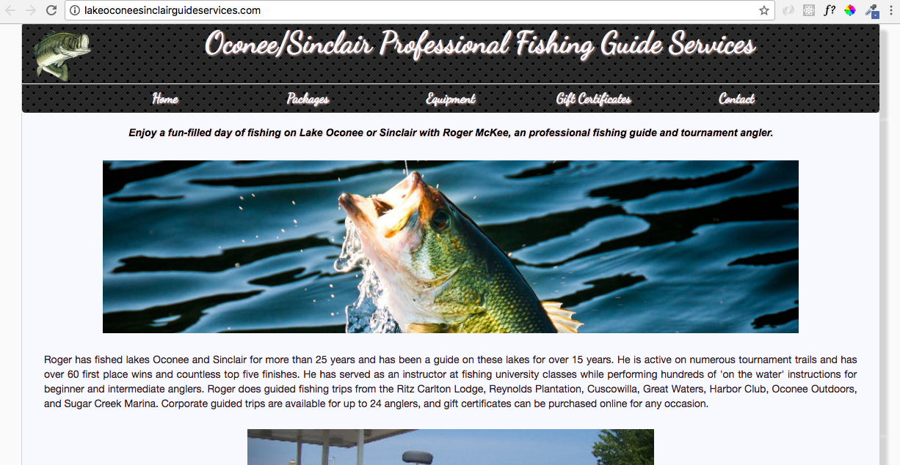

# Lake Oconee Sinclair Professional Fishing Guide Services Website
---

## Description
This is the codebase for the official Lake Oconee Sinclair Professional Fishing Guide Services website.  
<br>
<br>



## Author: Chad McKee
* <a href="https://github.com/chadm9">GitHub</a>
* <a href="http://wchadmckee.com/">Personal Website</a>
* <a href="https://www.linkedin.com/in/w-chad-mckee-88939163/">LinkedIn</a>

## Languages and Technologies used
* JavaScript
* jQuery
* HTML
* CSS


## Dependencies and Plugins
* Bootstrap
* Google Fonts

## Website
* <a href="http://lakeoconeesinclairguideservices.com/">Lake Oconee Sinclair Professional Fishing Guide Services</a>


## Code Snippet

### Submitting the Contact Form Information to a Remote Server
The following code snippet demonstrates the front end handling of the contact form submission event.  
<br>
```JavaScript
$(document).ready(function () {
    //Define a function to handle form submission
    $('#contact-form').submit(function(event){
        //Prevent the default JavaScript behavior 
        event.preventDefault();
        var fieldsDefined = true;
        $('#form-error').html('');
        $('#form-submission').html('');
        
        //Loop over the form input fields.
        $('input').each(function(){
        //If any field is not filled out, dispaly an error message
            if($(this).val() ===''){
                $('#form-error').html('*All input fields are required.');
                fieldsDefined = false;
            }
        });
        //If all fields are filled in, assign their values to variables to be
        //passed via an AJAX request
        if(fieldsDefined){
            var name = $('#name').val();
            var email = $('#email').val();
            var phone = $('#phone').val();
            var message = $('#message').val();

            //Perform the AJAX request
            $.ajax({
                method: "POST",
                url: "http://location_hidden",
                data: {
                    name: name,
                    email: email,
                    phone: phone,
                    message: message
                }
            });
            //Reset the input fields to blank values and alert the user
            //that the form has been sent
            $('#name').val('');
            $('#email').val('');
            $('#phone').val('');
            $('#message').val('');
            $('#form-submission').html('Your message has been sent.')
        }

    });
});
  ```

